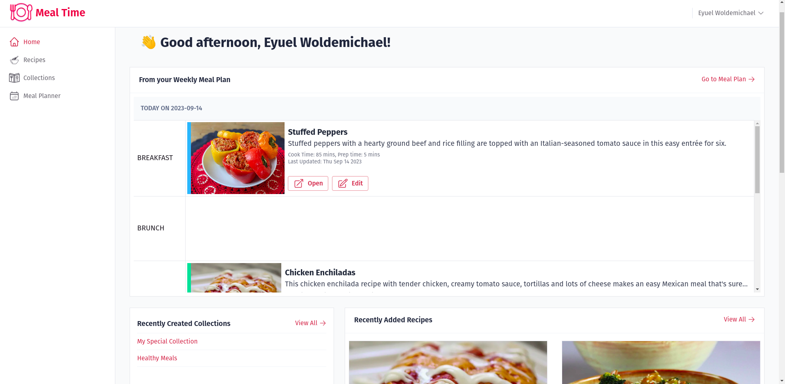

<p align="center">
  <a href="https://github.com/eyuelberga/MealTime">
    
  </a>
</p>

  <p align="center">
    A free and open source meal planner and recipe manager
    <br />
    <br />
    <a href="https://mealtime.eyuelberga.com/">View the demo</a>
    ·
    <a href="https://github.com/eyuelberga/MealTime/issues">Report a bug</a>
    ·
    <a href="https://github.com/eyuelberga/MealTime/issues">Request a feature</a>
    ·
    <a href="https://github.com/eyuelberga/MealTime/discussions">Ask questions</a>
  </p>


- [About Meal Time](#about-mealtime)
  - [Purpose](#purpose)
- [Features](#features)
- [Who's it for?](#whos-it-for)

- [Getting Started](#getting-started)
- [Contributing](#contributing)
  - [Development](#development)
- [License](#license)

## About Meal Time

<p align="center">
	
</p>

Meal Time is a meal planning and recipe management application designed to simplify your culinary journey. Whether you're a seasoned chef or just getting started in the kitchen, Meal Time has an array of features to streamline your meal planning process.

### Purpose

Meal Time aims to help you easily plan, organize, and execute your meals. Our goal is to make meal planning a breeze, enabling you to:

- Effortlessly create and manage meal plans.
- Manage recipes from various sources.
- Organize your recipes in collections for easy retrieval.
- Monitor and analyze your dietary choices.

### Demo Video

<div align="center">
  <a href="https://www.youtube.com/watch?v=cpqgIqZget4"></a>
</div>


## Features

#### Meal Planner

- Plan your meals by day, week, or month with an intuitive calendar interface.
- Easily add recipes to your meal plan for each day.
- Get a nutritional breakdown of your meal plan to help you achieve your dietary goals.

#### Recipe Management
- Save and organize your favorite recipes in one place.
- Import recipes from external websites by simply pasting the link.
- View detailed information about each recipe, including nutritional data and upcoming schedules on your meal plan.

#### Collections
- Create custom collections to group recipes by cuisine, occasion, or any category you prefer.
- Organize your recipes efficiently, making it easy to find the perfect dish for any occasion.


## Who's it for?

Meal Time is perfect for:

- Home cooks looking to simplify their meal planning process.
- Health-conscious individuals aiming to track their nutritional intake.
- Food enthusiasts who want to collect and organize their favorite recipes.
- Anyone interested in maintaining a well-structured meal schedule.

## Getting Started

You can try out Meal Time through the [demo site](mealtime.eyuelberga.com). 

## Contributing

Contributions are welcome. If you'd like to contribute, please follow these steps:

1. Fork the Meal Time repository on GitHub.
2. Create a new branch for your feature or bug fix.
3. Make your changes and commit them with clear, concise messages.
4. Submit a pull request detailing your changes and the problem you're addressing.

### Development 

You can setup a development environment for Meal Time using `docker` and `docker-compose`.

Change your current working directory to the root of the project and run the following command first:

```bash
$ docker-compose run --rm start_dependencies
```
This will make sure the mysql server is up and running before the other services start. 

Then you can start the rest of the services:

```bash
$ docker-compose up
```

If you are working on a specific service you can also start only that service and dependencies by running:

```bash
$ docker-compose up <service-name>
# for example:
$ docker-compose up api
```


## License

Meal Time is open-source software released under the MIT License. You are free to use, modify, and distribute this software in accordance with the terms of the license. For more details, please refer to the [LICENSE](/LICENSE) file.
